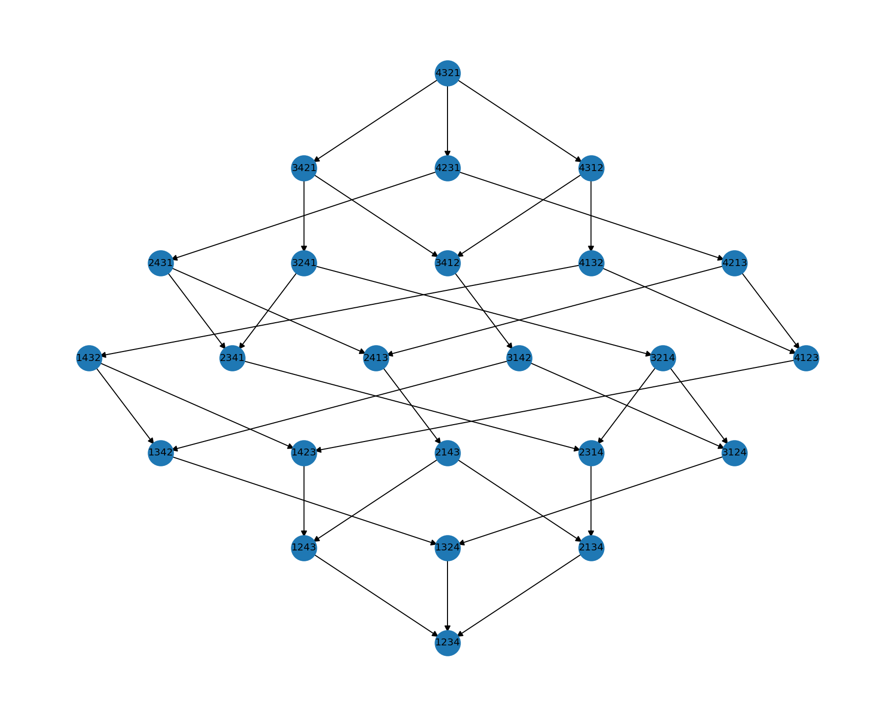
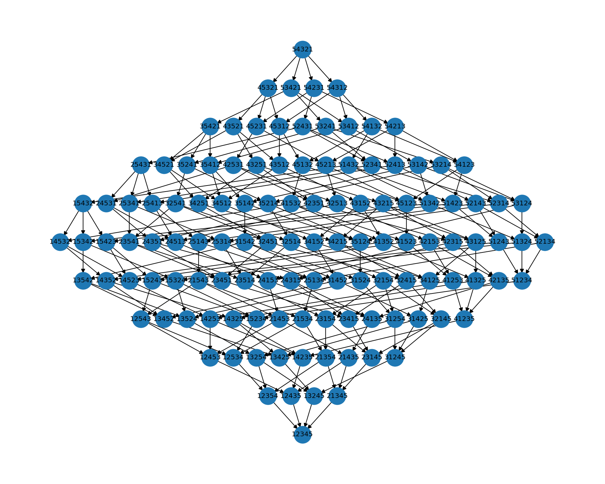
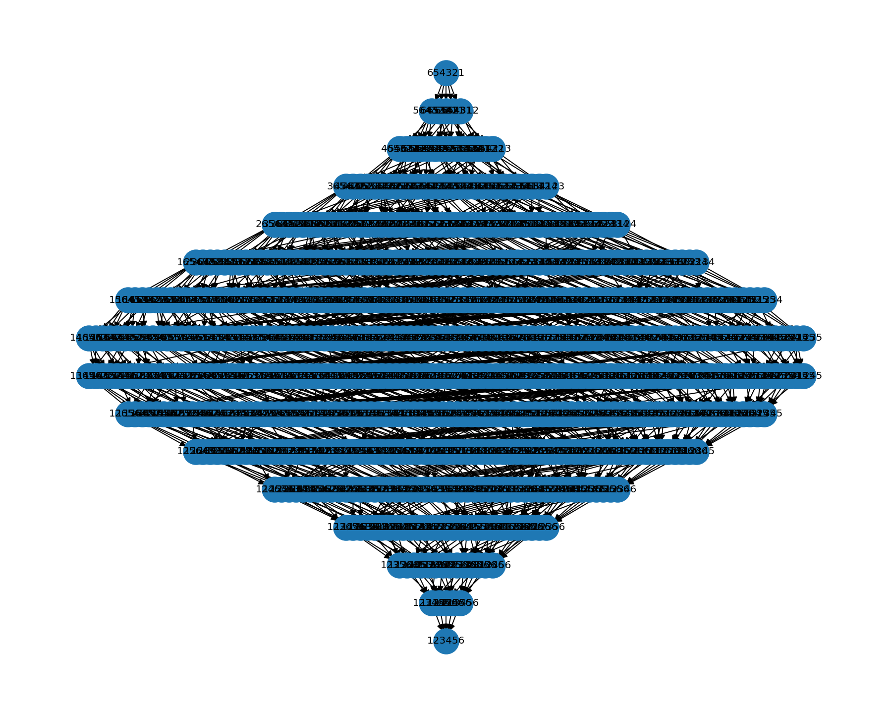

# An Exploration Of The Bubble Sort Multiway System
**An Experiment In Ruliology**

William Doyle

Figure 1: The multiway system of bubble sort on a fully distinct (meaning we have not allowed for the same number to appear twice) list of 4 numbers. The system begins at the reversed list and ends with a fully sorted list. Along the way the system undergoes a process of branching and merging before terminating at a single node where the list is sorted. Every possible state of the list is represented as a node in the structure. 

In Figure 2 we increase the state size to 5 numbers. 

In Figure 3 we increase the state size to 6 numbers. 

So far we have not allowed duplicate entries in our state. [cite michael levin interview where he mentions allowing duplicate entries]. Let us now explore what happens when we allow for duplicates. But first we must consider the role of the observer. When two values in the same state are the same will we represent them as the same thing? That is to say will we have a second unique "id" independent of the value of the entry in the state? For now we will not. This means we should expect a second kind of merging to occure where two states merge due to ambiguity between "versions" of a states list entry.